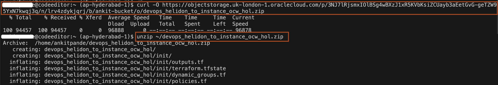

# Provision the Infrastructure

## Introduction

In this lab, you will create a compartment, dynamic groups, user groups and polices. Then you will create a DevOps project and its related resources using the Terraform in OCI Code Editor.

Estimated time: 10 minutes

### Objectives

In this lab, you will:

* Open Code Editor to download the Terraform script.
* Provision the compartment, dynamic groups, user groups and policies.
* Provision the resources required for DevOps project

### Prerequisites

* An Oracle Free Tier(Trial), Paid or LiveLabs Cloud Account
* Familiarity with compartments, dynamic group, user groups and policies

## Task 1: Open Code Editor and download the source code

1. In Cloud Console, click the *Developer tools* icon as shown and then click *Code Editor*.


2. Click *Terminal*-> *New Terminal* to open the terminal.


3. Copy and paste the following command to the terminal to download the source code. This source code contains the terraform scripts which creates the OCI resources required for this workshop. 

    ```bash
    <copy>curl -LSs https://objectstorage.uk-london-1.oraclecloud.com/p/p6rJ_WzkJq_THpuLmDPqyX0gcHYj-R_G25A4W0tMTsoV5pDbeQoqgegIK_PL6395/n/lrv4zdykjqrj/b/ankit-bucket/o/devops_helidon_to_instance_ocw_hol.zip >~/devops_helidon_to_instance_ocw_hol.zip
    unzip ~/devops_helidon_to_instance_ocw_hol.zip</copy>
    ```


4. To open the source code in workspace, click *File*-> *Open*.


5. Select the *`devops_helidon_to_instance_ocw_hol`* in your home directory and click *Open*.


6. Click the file name *terraform.tfvars* inside the *init* folder of *`devops_helidon_to_instance_ocw_hol`* as shown. You can see we have four variable (`tenancy_ocid`, region, `compartment_ocid`, `user_ocid` ) for which we need to provide the values. 


7. In your browser, open a new tab for [Cloud Console](https://cloud.oracle.com/). We will use this tab to get the value of above variables.

8. To get the `tenancy_ocid`, Click *User icon* and then click *Tenancy* as shown.


9. Click *Copy* to copy the OCID for tenancy and paste it in *terraform.tfvars* file as the value of *`tenancy_ocid`*.


10. You can find your home region name in Cloud console as shown. Then open the [URL](https://docs.oracle.com/en-us/iaas/Content/Registry/Concepts/registryprerequisites.htm#Availab) to find end points of this region. For example, in my case *India South(Hyderabad)* is home region and its end point is *ap-hyderabad-1*. Paste the end point of your home region in *terraform.tfvars* file as the value of *region*.


11. To get the `user_ocid`, click *User icon* and then click *MyProfile* as shown.


12. Click *Copy* to copy the OCID for user and paste it in *terraform.tfvars* file as the value of *`user_ocid`*.


13. Finally, your *terraform.tfvars* should look like this. Leave the value of *`compartment_ocid`* as it is. We will replace the value, once compartment will be created as part of Task 2.


## Task 2: Create a Compartment, Dynamic Groups, User Group and Policies

The goal of this task is to prepare the environment for the DevOps setup by creating a Compartment, Dynamic Groups, User Group and Polices. This section requires a user with administrator privilege. If you don't have it, make sure to request another user with such privilege to run this for you.

1. In the terminal, copy and paste the following command to navigate to *init* folder.
    ```bash
    <copy>cd ~/devops_helidon_to_instance_ocw_hol/init/</copy>
    ```

2. In Code Editor, you can view various files in *init* folder. These are the terraform scripts which creates the compartment, dynamic groups, user group and policies.


3. Copy and paste the following commands to provision the compartment, dynamic groups, user group and policies. 
    ```bash
    <copy>terraform init
    terraform plan
    terraform apply -auto-approve</copy>
    ```
    you will see output similar to below.
    

## Task 3: Create a DevOps project and its resources


You may now **proceed to the next lab.**

## Acknowledgements

* **Author** -  Keith Lustria
* **Contributors** - Ankit Pandey, Maciej Gruszka
* **Last Updated By/Date** - Ankit Pandey, May 2023
